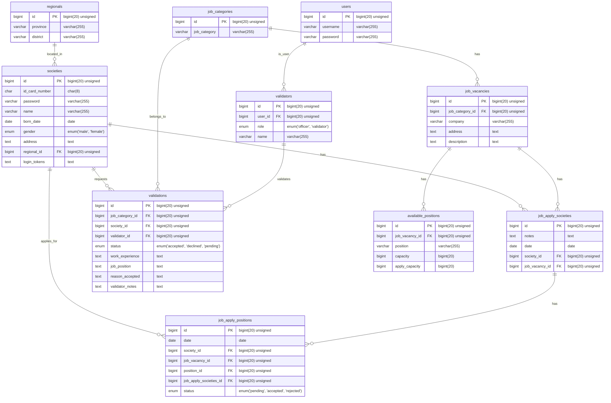

# 🌟 Platform Pencari Kerja 🌟

Platform ini adalah solusi inovatif untuk menjembatani kesenjangan antara pencari kerja dan pasar kerja di Indonesia. Dikembangkan untuk mengatasi tantangan pengangguran, terutama bagi lulusan baru dan mereka yang kehilangan pekerjaan, platform ini menyediakan pengalaman daring yang mulus bagi individu untuk menemukan peluang kerja yang sesuai tanpa perlu hadir secara fisik di lokasi perusahaan. Tujuan utamanya adalah memudahkan masyarakat menemukan pekerjaan dan melihat kapan serta di mana mereka dapat datang ke lokasi perusahaan.

-----

## 🚀 Teknologi yang Digunakan

Proyek ini dibangun dengan pendekatan modern, memisahkan frontend dan backend untuk skalabilitas dan pemeliharaan yang lebih baik.

  * **Frontend**: React/Vue/Angular/Blade atau sejenisnya
  * **Backend**: Laravel API atau sejenisnya

-----

## ✨ Fungsionalitas Utama

Platform ini menawarkan serangkaian fitur inti untuk memberdayakan pencari kerja dalam perjalanan mereka menemukan pekerjaan impian:

### 1\. Autentikasi: Gerbang Awal ke Dunia Kerja 🚪

Masyarakat harus terlebih dahulu login menggunakan nomor KTP dan kata sandi mereka untuk dapat masuk ke sistem dan mengakses fitur-fitur platform. Untuk keamanan data pengguna, sistem secara otomatis membuat token autentikasi berbasis HASH dari nomor KTP setelah login berhasil. Tombol logout akan muncul setelah login, memungkinkan pengguna untuk keluar dari sistem.

#### 🌐 Komponen Frontend

  * Judul `Job Seeker Platform`
  * Form isian `Nomor KTP`
  * Form isian `Kata Sandi`
  * Tombol `Login`

#### ⚙️ Spesifikasi API Backend (A1)

| Fitur                | URL                                 | Metode | Params  | Body                                        | Respons (Sukses)                                                                                                              | Respons (Gagal)                                                                       |
| :------------------- | :---------------------------------- | :----- | :------ | :------------------------------------------ | :---------------------------------------------------------------------------------------------------------------------------- | :------------------------------------------------------------------------------------ |
| **Login Masyarakat** | `[domain]/api/v1/auth/login`        | `POST` | -       | `id card number: "SomeText", password: "SomeText"` | `200 OK`, `{name, born_date, gender, address, token, regional{province, district}}` | `401 Unauthorized`, `"message": "ID Card Number or Password incorrect"` |
| **Logout Masyarakat**| `[domain]/api/v1/auth/logout`       | `POST` | `token` | -                                           | `200 OK`, `"message": "Logout success"`                                                                                   | `401 Unauthorized`, `"message": "Invalid token"`                |

#### ✅ Persyaratan Fungsional

  * Bisa login menggunakan ID dan Password yang benar.
  * Menampilkan pesan login sukses dan setelah di klik OK akan membuka DASHBOARD.
  * Jika ID atau password salah akan menampilkan pesan `ID atau Password salah`.
  * Jika sudah login tidak bisa kembali ke halaman sebelumnya atau tidak bisa kembali membuka halaman login.

-----

### 2\. Validasi Data: Menjaga Keaslian Informasi 🛡️

Tidak semua orang dapat langsung melamar pekerjaan. Masyarakat harus terlebih dahulu memvalidasi data mereka untuk memastikan informasi yang diberikan benar. Setiap masyarakat hanya diperbolehkan mengajukan satu kali permintaan validasi untuk menghindari penyalahgunaan sistem. Mereka dapat melihat status validasi mereka dan, jika diperlukan, mengajukan permintaan validasi kepada petugas.

#### 📊 Komponen Frontend (Dashboard & Permintaan Validasi Data)

  * **Dashboard:**

      * Judul `Job Seeker Platform`
      * Nama user (misalnya `Marsito Kusowwati`)
      * Opsi `Logout`
      * Judul `Dashboard`
      * Sidebar `My Data Validation`
      * Bagian `Data Validation`
      * Tombol `+ Request validation`
      * Judul `My Job Applications`
      * Pesan peringatan jika validasi belum disetujui: `Your validation must be approved by validator to get the vaccine.`
      * Tampilan status `data validation progress` (e.g., `pending`, `accepted`, `rejected`)
      * `Job Category`, `Job Position`, `Reason Accepted`, `Validator`, dan `Validator Notes` untuk hasil validasi data
      * Tombol `+ Add Job Applications`
      * Menampilkan progress pengajuan lamaran ke perusahaan.

  * **Halaman Request Data Validation:**

      * Judul `Request Data Validation`
      * Dropdown `Job Category` dengan select option (e.g., `Computing and ICT`)
      * Dropdown `Work Experiences?` dengan select option (e.g., `Yes I have`)
      * Textarea `Job position separate with, (comma)`
      * Textarea `Describe your work experiences`
      * Textarea `Reason Accepted` / `Explain why you should be accepted`
      * Tombol `Send Request`

#### ⚙️ Spesifikasi API Backend (A2)

| Fitur                        | URL                                | Metode | Params  | Body                                                                                              | Respons (Sukses)                                          | Respons (Gagal)                       |
| :--------------------------- | :--------------------------------- | :----- | :------ | :------------------------------------------------------------------------------------------------ | :-------------------------------------------------------- | :------------------------------------ |
| **Request Data Validations** | `[domain]/api/v1/validation`       | `POST` | `token` | `work experience: "SomeText", job category: "JobCategoryID", job position: "SomeText", reason accepted: "SomeText"` | `200 OK`, `"message": "Request data validation sent successful"` | `401 Unauthorized`, `"message": "Unauthorized user"` |
| **Get Society Data Validation**| `[domain]/api/v1/validations`      | `GET`  | `token` | -                                                                                                 | `200 OK`, `{validation{id, status, work_experience, job_category_id, job_position, reason_accepted, validator_notes, validator}}` | `401 Unauthorized`, `"message": "Unauthorized user"` |

#### ✅ Persyaratan Fungsional

  * Bisa melakukan validasi data untuk authorized user.
  * Jika bukan authorized user akan muncul pesan `unauthorized user`.
  * Jika ada textarea yang kosong saat validasi maka akan muncul pesan `data ada yang kosong`.
  * Menampilkan progress pengajuan lamaran.
  * Menampilkan hasil lamaran.

-----

### 3\. Menjelajahi Lowongan Pekerjaan 🔍

Setelah data masyarakat divalidasi, mereka dapat mulai mencari pekerjaan. Sistem memungkinkan pengguna untuk memilih kategori pekerjaan yang sesuai dengan data mereka. Semua lowongan pekerjaan yang tersedia di berbagai perusahaan akan ditampilkan, lengkap dengan detail seperti posisi yang tersedia dan jumlah pelamar yang telah mendaftar untuk posisi tersebut.

#### 🖥️ Komponen Frontend

  * Judul halaman `Job Vacancies`
  * Judul `List of Job Vacancies`
  * `Nama Perusahaan` (e.g., `PT. Maju Mundur Sejahtera`)
  * `Alamat Perusahaan` (e.g., `Dr. Abdullah No. 31, DKI Jakarta`)
  * `Available Position (Capacity)` (e.g., `Desain Grafis (3), Programmer (1), Manager (7)`)
  * Bidang lowongan dan jumlahnya (e.g., `Desain Grafis (1)`)
  * Tombol `Detail / Apply`
  * Tombol `Vacancies have been...` (untuk lowongan yang sudah dilamar)

#### ⚙️ Spesifikasi API Backend (A3)

| Fitur                                    | URL                                    | Metode | Params    | Body | Respons (Sukses)                                                                                                                                                                                                                                                                                                                                                                  | Respons (Gagal)                       |
| :--------------------------------------- | :------------------------------------- | :----- | :-------- | :--- | :------------------------------------------------------------------------------------------------------------------------------------------------------------------------------------------------------------------------------------------------------------------------------------------------------------------------------------------------------------------ | :------------------------------------ |
| **Get all job vacancy by chosen job category**| `[domain]/api/v1/job_vacancies`        | `GET`  | `token`   | -    | `200 OK`, `{vacancies[{id, category{id, job category}, Company{id, name, address, description}, available_position[{position, capacity, apply_capacity}]}]}`                                                                                                                               | `401 Unauthorized`, `"message": "Unauthorized user"` |
| **Get job vacancy detail by vacancy ID and date**| `/api/v1/job_vacancies/<id>`         | `GET`  | `token, id` | -    | `200 OK`, `{id, vacancy{category{id, job_category}, company, address, description}, available_position[{position, capacity, apply_capacity, apply_count}]}` | `401 Unauthorized`, `"message": "Unauthorized user"` |

#### ✅ Persyaratan Fungsional

  * Bisa menampilkan semua lowongan dari database.
  * Bisa menampilkan lowongan yang sudah di lamar (`vacancies has been..`).
  * Bisa menampilkan bidang lowongan dan jumlahnya.

-----

### 4\. Melamar Pekerjaan: Kesempatan Sekali Seumur Hidup ✉️

Ketika menemukan pekerjaan yang sesuai, masyarakat dapat melamar pekerjaan hanya satu kali untuk setiap lowongan. Mereka harus memasukkan ID lowongan dan posisi yang ingin mereka lamar. Jika ada lebih dari satu posisi yang tersedia dan belum mencapai batas maksimum pelamar, mereka dapat memilih lebih dari satu posisi.

#### 📝 Komponen Frontend

  * Judul `nama perusahaan` (e.g., `PT. Maju Mundur Sejahtera`)
  * `Alamat perusahaan` (e.g., `Jin. HOS Cokroaminoto (Pasirkaliki) No. 900, DKI Jakarta`)
  * Bagian `Description`
  * `Some description of job vacancy`
  * Bagian `Select position`
  * Tabel dengan kolom `Position`, `Capacity`, `Application / Max`
  * Bidang lowongan (e.g., `Desain Grafis`, `Programmer`, `Manager`)
  * Jumlah `capacity` (e.g., `3`, `1`, `1`)
  * Jumlah `application / max` (e.g., `6/12`, `3/8`, `22/22`)
  * `Notes for Company`
  * Textarea `Explain why you should be accepted`
  * Tombol `Apply for this job`

#### ⚙️ Spesifikasi API Backend (A4)

| Fitur                                | URL                                | Metode | Params    | Body                                        | Respons (Sukses)                                   | Respons (Gagal)                                                                                                                                         |
| :----------------------------------- | :--------------------------------- | :----- | :-------- | :------------------------------------------ | :------------------------------------------------- | :------------------------------------------------------------------------------------------------------------------------------------------------------ |
| **Applying for jobs** | `/api/v1/applications`             | `POST` | `token`   | `vacancy id: 1, positions: [position 1, ...], notes: "SomeText"` | `200 OK`, `"message": "Applying for job successful"` | `401 Unauthorized`, `"message": "Unauthorized user"`\<br\>`401 Unauthorized`, `"message": "Your data validator must be accepted by validator before"`\<br\>`401 Unauthorized`, `"message": "Invalid field", errors:{vacancy id, positions}`\<br\>`401 Unauthorized`, `"message": "Application for a job can only be once"` |
| **Get all of society job applications**| `[domain]/api/v1/applications`     | `GET`  | `token`   | -                                           | `200 OK`, `{vacancies[{id, category{id, job category}, company, address, position[{position, apply_status, notes}]}]}` | `401 Unauthorized`, `"message": "Unauthorized user"` |

#### ✅ Persyaratan Fungsional

  * Bisa menampilkan nama perusahaan dari database.
  * Bisa menampilkan alamat perusahaan dari database.
  * Bisa menampilkan bidang lowongan.
  * Bisa menampilkan jumlah posisi.
  * Bisa menampilkan jumlah posisi dan posisi yang sudah dilamar ($6/12$).
  * Button bisa digunakan melamar pekerjaan.
  * Bisa validasi jika textarea kosong.
  * Bisa validasi satu posisi hanya bisa dilamar satu kali.

-----

## 🏗️ ERD (Entity-Relationship Diagram)

Diagram ERD di bawah ini dapat digunakan dan ditingkatkan untuk desain basis data Anda. Diagram ini mencakup berbagai tabel yang mencerminkan struktur data platform.

-----

## 🤝 Kontribusi

Kami menyambut kontribusi dari komunitas\! Jika Anda memiliki ide atau ingin meningkatkan platform ini, silakan ajukan *pull request* atau buka *issue*.

-----

